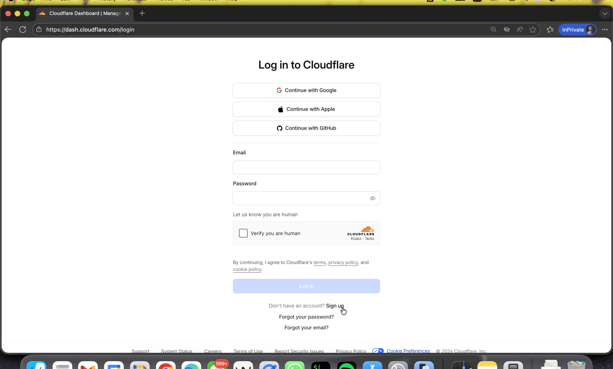
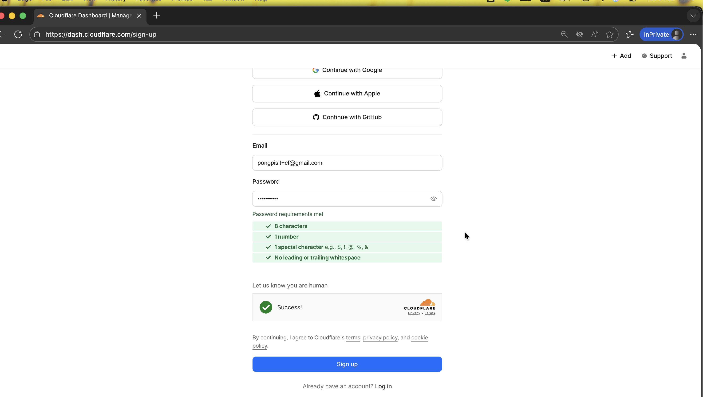
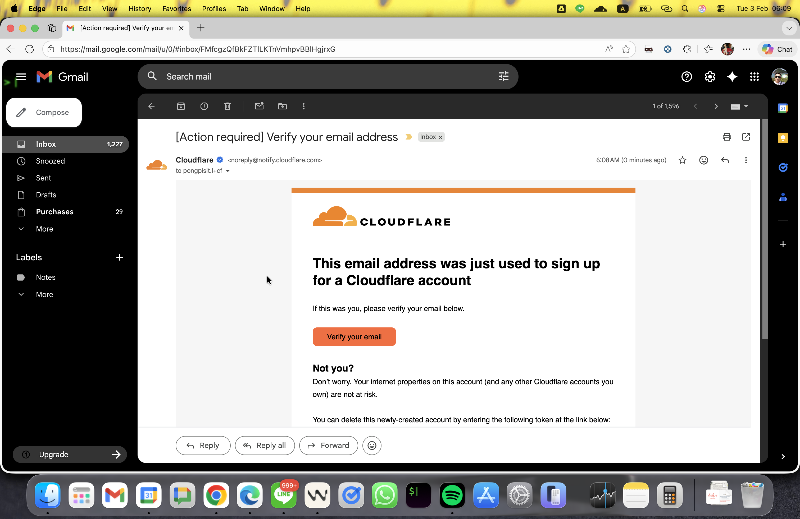

# Module 1: Account Setup

**Duration:** 10 minutes

## Objective

Create a free Cloudflare account and access the Dashboard.

---

## Step 1: Sign Up for Cloudflare

1. Open your web browser
2. Go to: **https://dash.cloudflare.com/sign-up**

3. Fill in the form:
   - **Email:** Enter your university email address
   - **Password:** Create a strong password (minimum 8 characters)

4. Click **Create Account**

---

## Step 2: Verify Your Email

1. Check your email inbox
2. Look for email from Cloudflare (check spam folder if needed)
3. Click the **Verify Email** link in the email
4. You'll be redirected to the Cloudflare Dashboard

---

## Step 3: Access the Dashboard

1. You should now see the Cloudflare Dashboard
2. URL: **https://dash.cloudflare.com**

3. If prompted to add a domain, click **Skip** (not needed for this workshop)

---

## Step 4: Access Zero Trust

1. In the **left sidebar**, click **Zero Trust**
2. If this is your first time:
   - Click **Get started**
   - Choose a **team name** (e.g., `my-university-team`)
   - Click **Continue**
3. You'll be redirected to: **https://one.dash.cloudflare.com**
4. This is your Zero Trust Dashboard

---

## Step 5: Verify Account is Ready

1. In the top-right corner, click your **profile icon**
2. Verify your email address is shown
3. Account type should show **Free Plan**

---

## ✅ Checkpoint

You should now have:
- ✅ Cloudflare account created
- ✅ Email verified
- ✅ Dashboard accessible
- ✅ Zero Trust Dashboard accessible
- ✅ Free plan active

---

## Next Steps

Continue to [Module 2: Deploy Website with Cloudflare Pages](./02-pages-deployment.md)
