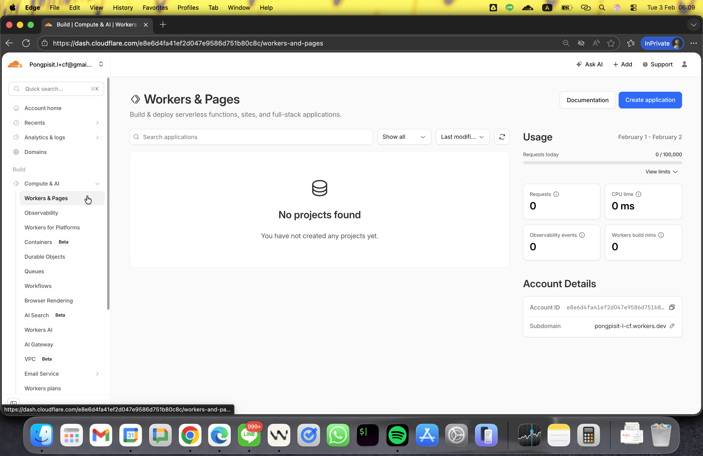
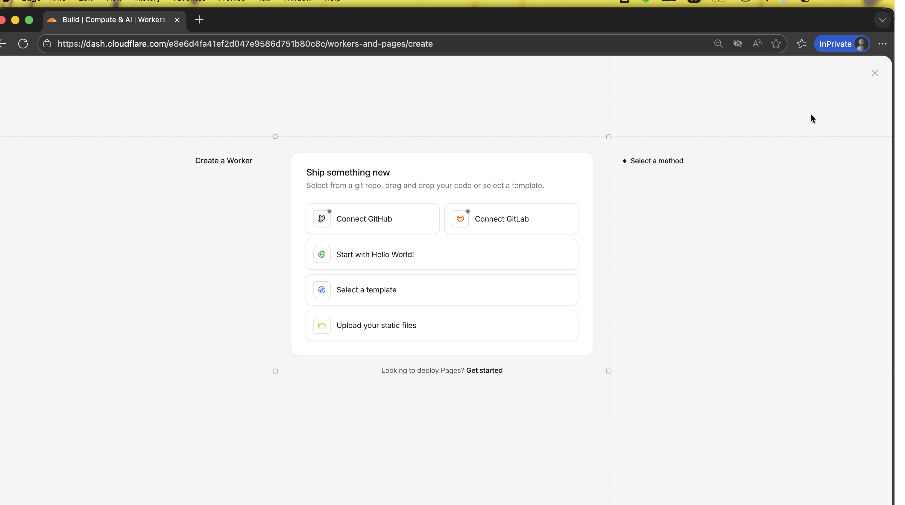
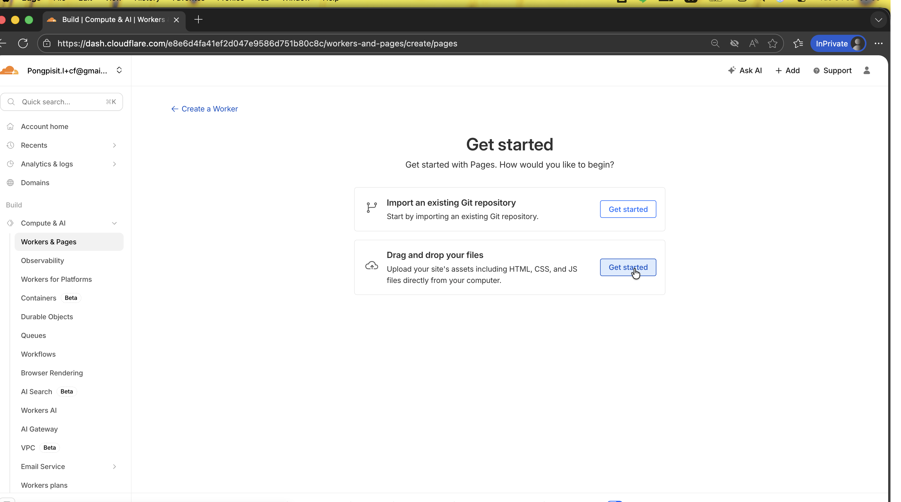
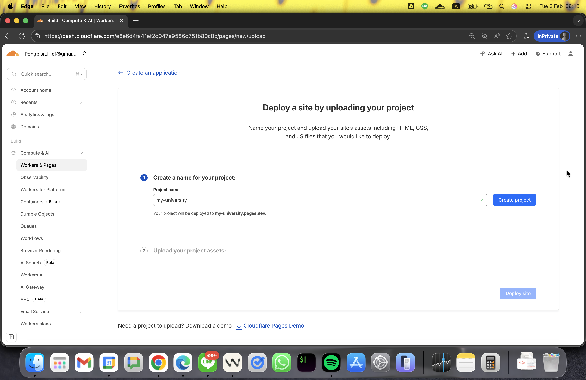
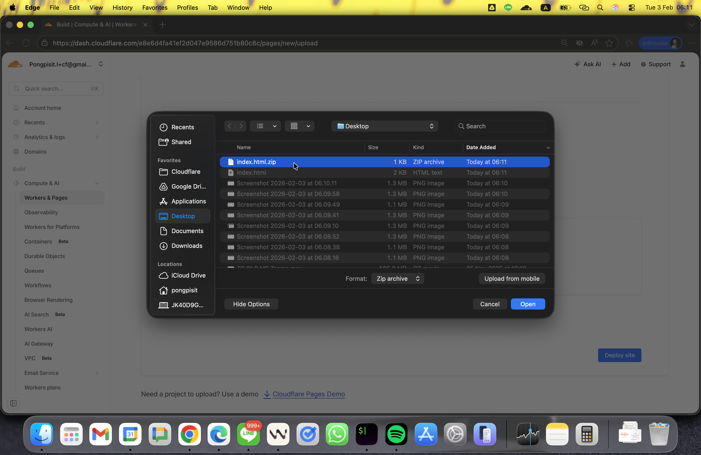
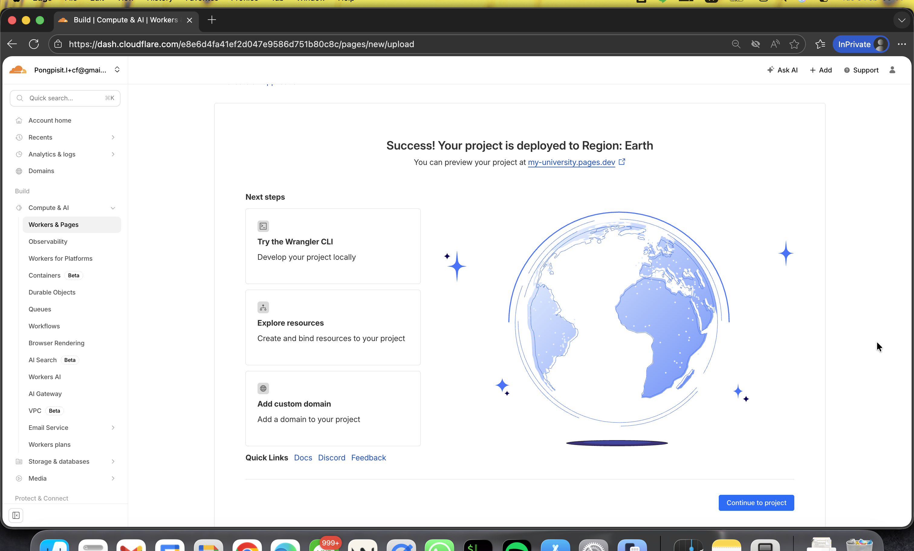
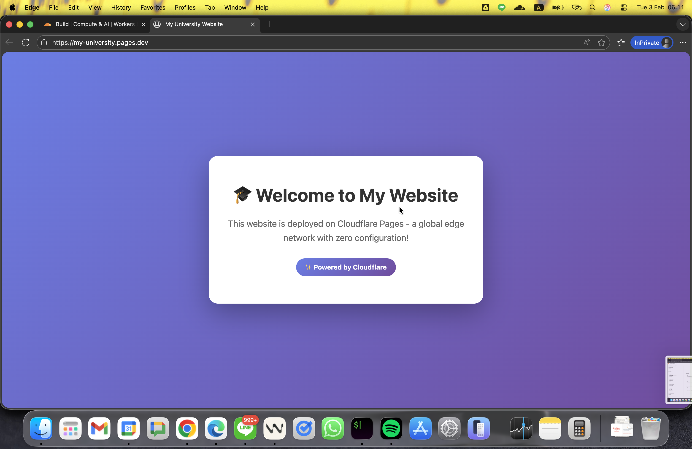
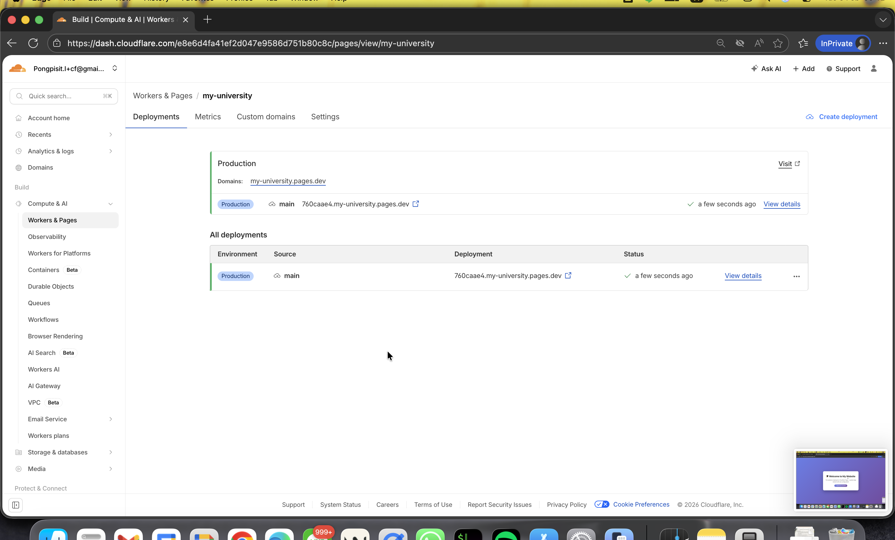

# Module 2: Deploy Website with Cloudflare Pages

**Duration:** 30 minutes

## Objective

Deploy a static website to Cloudflare Pages using direct upload.

---

## Step 1: Create Your Website Files

### Create index.html

1. Open a text editor (Notepad, TextEdit, VS Code, etc.)
2. Copy and paste this code:

```html
<!DOCTYPE html>
<html lang="en">
<head>
    <meta charset="UTF-8">
    <meta name="viewport" content="width=device-width, initial-scale=1.0">
    <title>My University Website</title>
    <style>
        * {
            margin: 0;
            padding: 0;
            box-sizing: border-box;
        }
        body {
            font-family: -apple-system, BlinkMacSystemFont, 'Segoe UI', sans-serif;
            background: linear-gradient(135deg, #667eea 0%, #764ba2 100%);
            min-height: 100vh;
            display: flex;
            align-items: center;
            justify-content: center;
            padding: 20px;
        }
        .container {
            background: white;
            border-radius: 20px;
            padding: 60px 40px;
            max-width: 600px;
            box-shadow: 0 20px 60px rgba(0,0,0,0.3);
            text-align: center;
        }
        h1 {
            color: #333;
            font-size: 2.5em;
            margin-bottom: 20px;
        }
        p {
            color: #666;
            font-size: 1.2em;
            line-height: 1.6;
            margin-bottom: 30px;
        }
        .badge {
            display: inline-block;
            background: linear-gradient(135deg, #667eea 0%, #764ba2 100%);
            color: white;
            padding: 10px 20px;
            border-radius: 25px;
            font-size: 0.9em;
            font-weight: bold;
        }
    </style>
</head>
<body>
    <div class="container">
        <h1>🎓 Welcome to My Website</h1>
        <p>This website is deployed on Cloudflare Pages - a global edge network with zero configuration!</p>
        <div class="badge">✨ Powered by Cloudflare</div>
    </div>
</body>
</html>
```

3. Save the file as: **index.html**
4. Remember where you saved it

---

## Step 2: Navigate to Workers & Pages

1. Go to: **https://dash.cloudflare.com**
2. In the **left sidebar**, click **Build**
3. Click **Compute & AI**
4. Click **Workers & Pages**



---

## Step 3: Create a Pages Project

1. Click the **Create application** button (blue button, top right)
2. Click the **Pages** tab



3. Click **Upload assets**



---

## Step 4: Upload Your Website

1. **Project name:** Enter `my-university-site` (or any name you like)



2. Click **Create project**
3. You'll see the upload page
4. Click **Upload files** or drag and drop your **index.html** file



5. Click **Deploy site**

---

## Step 5: Wait for Deployment

1. You'll see a deployment progress screen
2. Wait for the status to show: **Success**
3. This usually takes 10-30 seconds



---

## Step 6: Access Your Website

1. Once deployed, you'll see a **Visit site** button
2. Click **Visit site**
3. Your website will open in a new tab
4. The URL will look like: `https://my-university-site.pages.dev`



---

## Step 7: Test Your Website

1. Verify your website loads correctly
2. Check that the styling appears properly
3. Copy the URL from your browser
4. Try opening it in a different browser or device
5. Share the URL with a colleague to test global access

---

## Step 8: View Deployment Details

1. Go back to the Cloudflare Dashboard
2. You should see your project listed under **Workers & Pages**
3. Click on your project name



4. Explore the tabs:
   - **Deployments** - View deployment history
   - **Settings** - Configure your project
   - **Analytics** - View traffic stats (after some visits)

---

## Step 9: Make an Update (Optional)

1. Edit your **index.html** file
2. Change the heading text to something else
3. Save the file
4. Go back to your project in the Dashboard
5. Click **Create deployment**
6. Upload the updated file
7. Click **Deploy site**
8. Visit your site again to see the changes

---

## ✅ Checkpoint

You should now have:
- ✅ Website files created (index.html)
- ✅ Pages project created
- ✅ Website deployed successfully
- ✅ Public URL accessible globally
- ✅ Automatic HTTPS enabled

---

## Key Features You Got Automatically

- **Global CDN** - Your site is served from 300+ locations worldwide
- **HTTPS/SSL** - Automatic secure connection
- **Unlimited Bandwidth** - No data transfer fees
- **DDoS Protection** - Automatic protection against attacks
- **Instant Deployments** - Changes go live in seconds

---

## Next Steps

Continue to [Module 3: DNS Security](./03-dns-security.md)
