# Module 3: DNS Security

**Duration:** 45 minutes

## Objective

Configure DNS filtering to block access to malicious domains (malware, phishing, command & control) using Cloudflare Gateway.

---

## Step 1: Check Domain Categories on Cloudflare Radar

Before testing, let's verify what categories Cloudflare assigns to the gambling site.

1. Open your web browser
2. Go to: **https://radar.cloudflare.com/domains/domain/ufabet.pics**
3. Look for the **Content Categories** section
4. You should see categories like:
   - **Gambling** (primary category)
   - Other related categories

**This confirms Cloudflare's threat intelligence categorizes this domain as gambling content.**

---

## Step 2: Test Before Configuration (Baseline)

Now let's test accessing the gambling site to see that it's currently accessible.

1. Open a new browser tab
2. Try to visit: **https://www.ufabet.pics/**

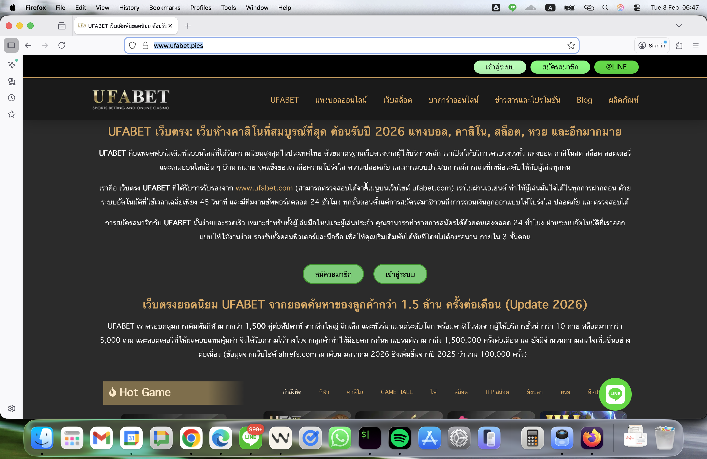

3. **Expected Result:**
   - Site loads normally (not blocked)
   - This shows you currently have no DNS filtering

**Note:** We'll test this same site again after configuration to verify blocking works.

---

## Step 3: Access Zero Trust Dashboard

1. Go to: **https://dash.cloudflare.com**
2. In the **left sidebar**, click **Zero Trust**
3. If this is your first time:
   - You'll see a welcome screen
   - Click **Get started** or **Continue**
   - Choose a **team name** (e.g., `my-university-team`)

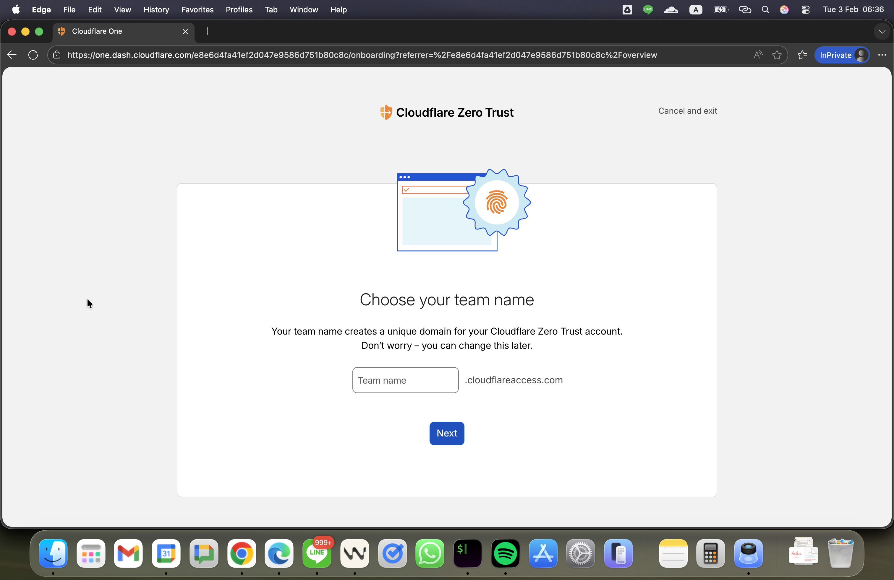

   - Click **Continue**

4. Select a plan (Free plan is sufficient for this workshop)

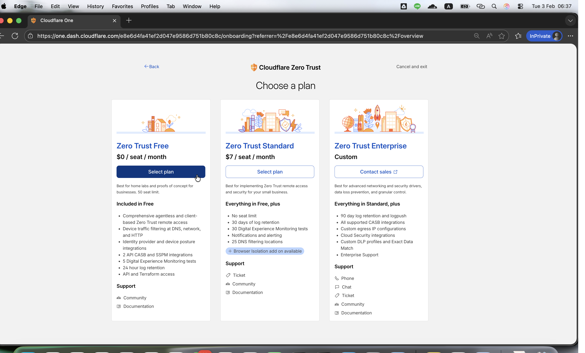

   - Click **Select plan** for Zero Trust Free

5. **Important:** If Cloudflare asks you to add credit card information:
   - You can **close the page** or click the **X** button
   - Go directly to: **https://one.dash.cloudflare.com**
   - The credit card popup will not appear again
   - The Free plan works without a credit card

6. You'll be redirected to: **https://one.dash.cloudflare.com**

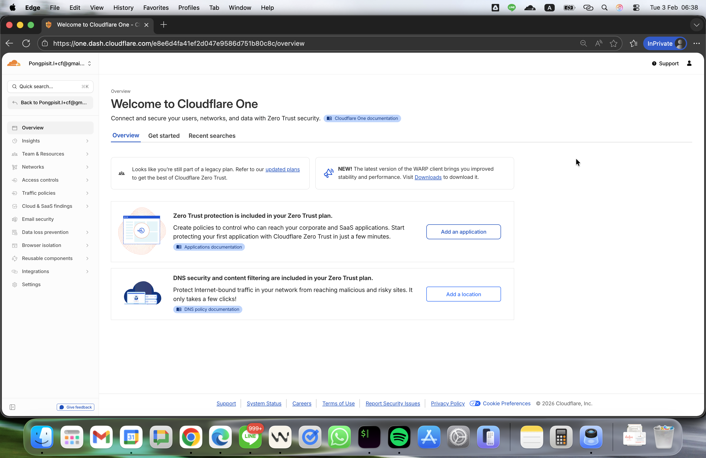

---

## Step 4: Navigate to DNS Policies

1. In the Zero Trust Dashboard left sidebar:
2. Click **Traffic policies**
3. Click **Firewall policies**
4. Click **DNS** tab

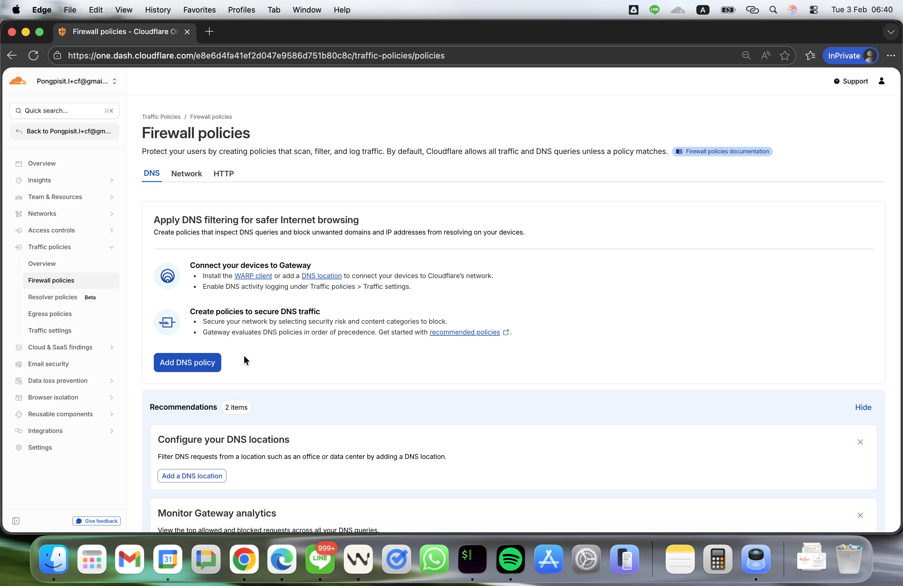

---

## Step 5: Create Security Threat Blocking Policy

1. Click **Add a policy** button

2. Fill in the policy details:

   **Policy name:** `Block Security Threats and Unwanted Websites`

3. **Traffic section:**

   - Click **Add condition**
   - **Selector:** Select `Security Categories`
   - **Operator:** Select `in`
   - **Value:** Check these categories:
     - ✅ Malware
     - ✅ Phishing
     - ✅ Scam
     - or All Security risks

4. **Add Children’s Internet Protection Act (CIPA) Filter categories:**
The Children's Internet Protection Act (CIPA) was enacted by Congress in 2000 to address concerns about children's access to obscene or harmful content over the Internet. The law aims to prevent students from accessing explicit, obscene, or otherwise harmful material. It also emphasizes the use of technology protection measures, including DNS filtering, to safeguard against Internet threats such as ransomware, phishing sites, and other potentially harmful content.
(https://www.fcc.gov/consumers/guides/childrens-internet-protection-act)
   - Click **+ Or**
   - **Selector:** Select `Content Categories`
   - **Operator:** Select `in`
   - **Value:** Check these categories:
     - ✅ CIPA Filter

6. **Action section:**

   - **Action:** Select `Block`
   - ✅ Enable **Modify Gateway block behavior**

7. Click **Save policy**

---

## Step 6: Create Content Filtering Policy for Gambling

1. Click **Add a policy** button
2. Fill in the policy details:

**Policy name:** `Block Gambling Sites`

**Traffic section:**
3. Click **Add condition**
4. **Selector:** Select `Content Categories`
5. **Operator:** Select `in`
6. **Value:** Check:
   - ✅ Gambling

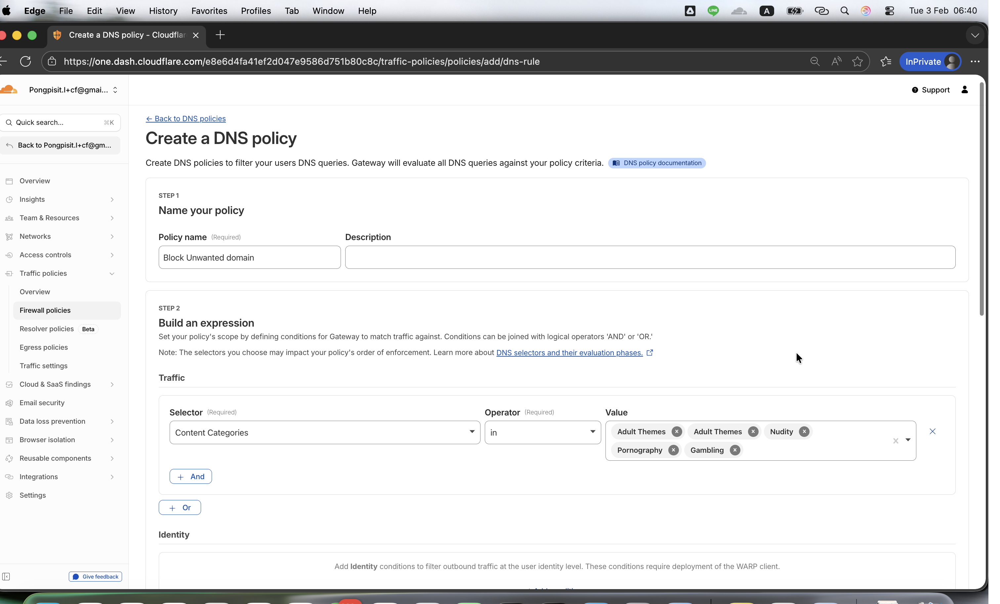

**Action section:**
7. **Action:** Select `Block`
8. ✅ Enable **Display block page**

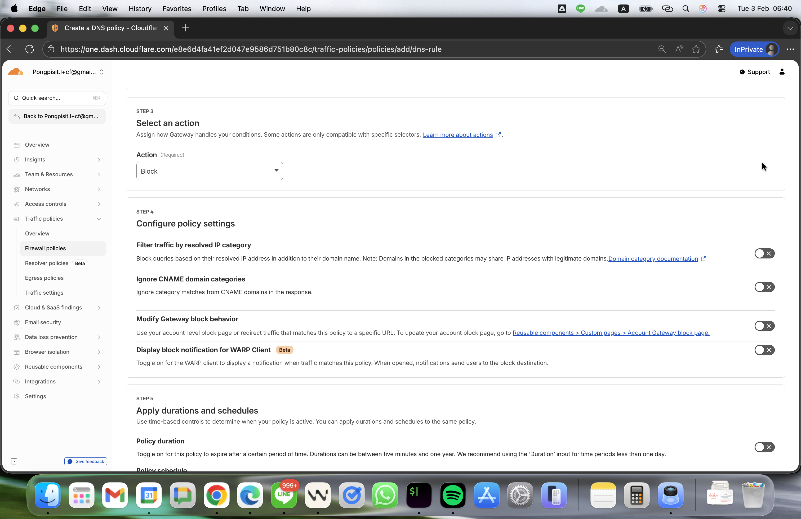

9. Click **Save policy**

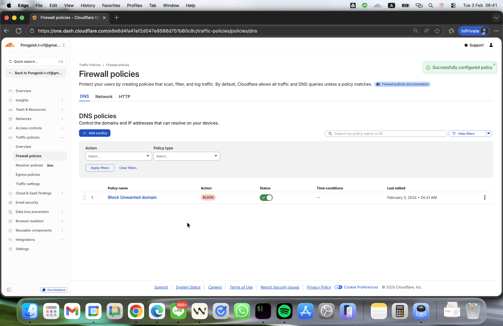

---

## Step 7: Create Allow List for Important Domains (Optional)

If you need to allow specific domains:

1. Click **Add a policy** button
2. **Policy name:** `Allow Important Domains`

**Traffic section:**
3. Click **Add condition**
4. **Selector:** Select `Domain`
5. **Operator:** Select `in`
6. **Value:** Enter domains (one per line):
   ```
   google.com
   microsoft.com
   cloudflare.com
   ```

**Action section:**
7. **Action:** Select `Allow`
8. Click **Save policy**

**Important:** Drag this policy to the **top** of the list (Allow policies should be first)

---

## Step 8: Get Your DNS Location

1. In the left sidebar, click **Networks**
2. Click **Resolvers & Proxies**

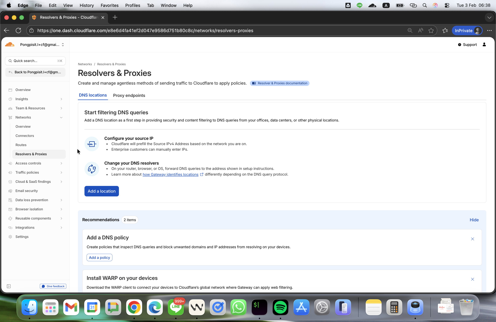

3. Click **DNS Locations** tab
4. Click **Add a location** button
5. Configure your DNS location:

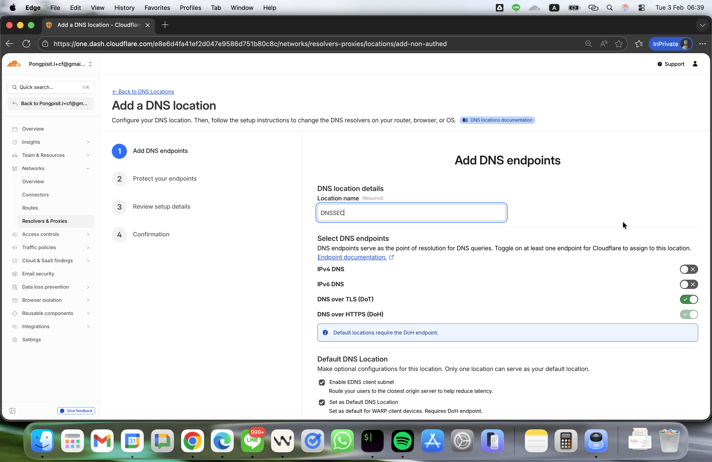

6. Protect your endpoints (optional settings):

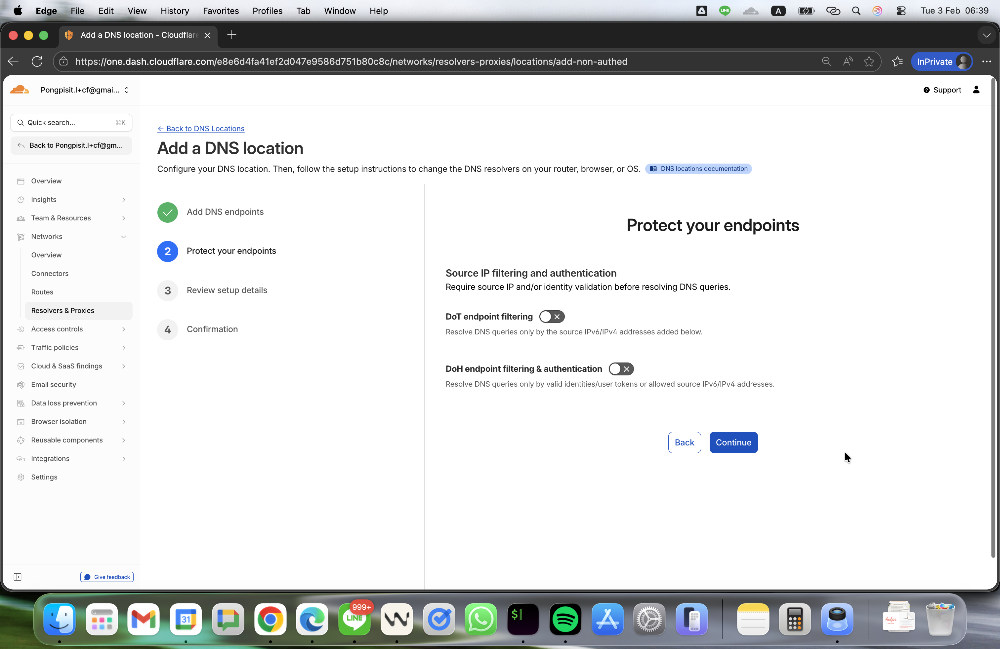

7. Review setup details:

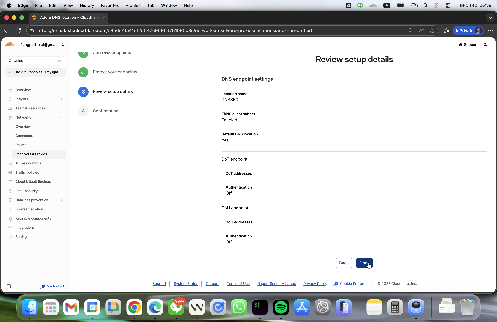

8. After confirmation, you'll see your **DoH subdomain**:

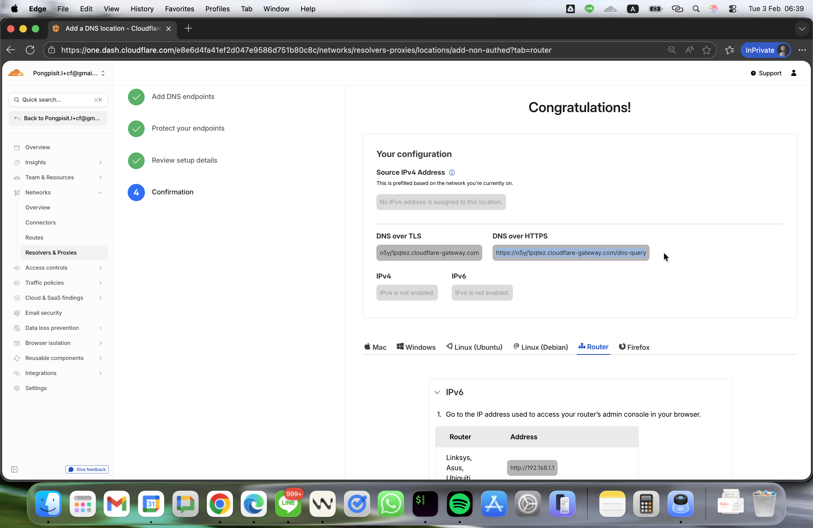

9. Copy the **DNS over HTTPS** URL
   - It looks like: `https://xxxxx.cloudflare-gateway.com/dns-query`
10. **Keep this URL** - you'll need it in the next step

---

## Step 9: Configure Browser to Use DoH

### For Chrome/Edge:

1. Open Chrome or Edge
2. Go to **Settings**
3. Search for: `secure dns`
4. Click **Security** (or **Privacy and security**)
5. Find **Use secure DNS**
6. Select **With Custom**
7. Paste your DoH URL: `https://xxxxx.cloudflare-gateway.com/dns-query`
8. Click **Save** or close settings

### For Firefox:

1. Open Firefox
2. Go to **Settings** (Menu → Settings)

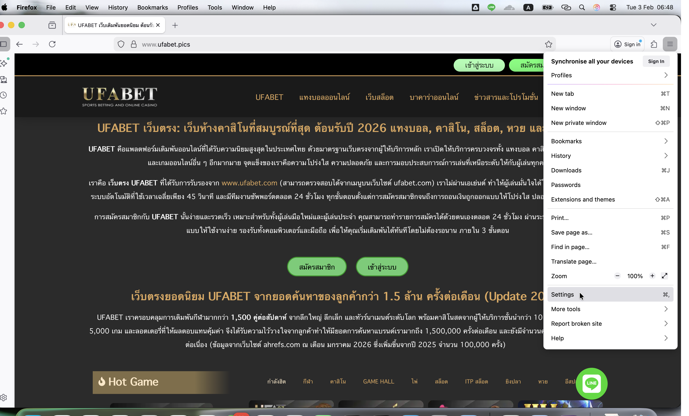

3. Search for: `dns`
4. Scroll to **Network Settings** or find **Enable DNS over HTTPS using:**

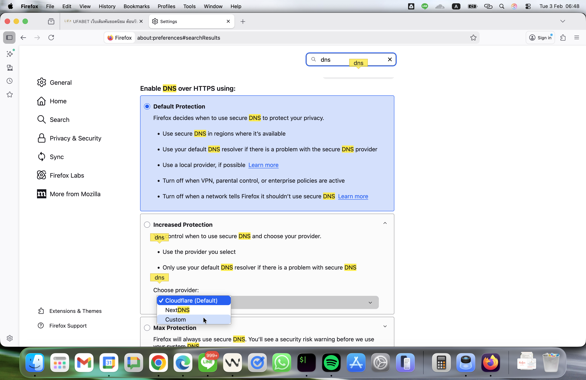

5. Select **Increased Protection** or **Custom**
6. Choose **Custom** from the dropdown
7. Paste your DoH URL: `https://xxxxx.cloudflare-gateway.com/dns-query`

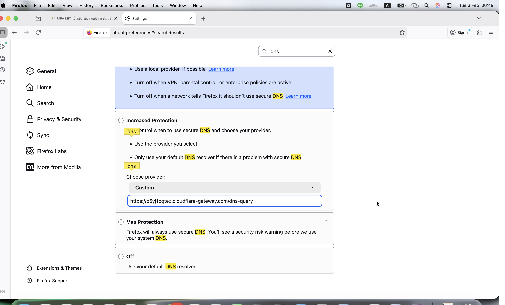

8. The settings will save automatically

### For Safari (macOS):

1. Open **System Settings**
2. Go to **Network**
3. Select your active connection (Wi-Fi or Ethernet)
4. Click **Details**
5. Click **DNS** tab
6. Click **+** under DNS Servers
7. Add: `1.1.1.1` and `1.0.0.1`
8. Note: Safari uses system DNS settings

---

## Step 10: Test DNS Security Blocking

### Test 1: Gambling Site Test

1. Open a new browser tab
2. Try to visit: **https://www.ufabet.pics/**
3. **Expected Result:**
   - **Cloudflare Gateway block page** appears
   - Message explains the site is blocked
   - Shows "Gambling" content category
   - Site that was accessible before is now blocked!

### Test 2: Malware Domain Test

1. Open a new browser tab
2. Try to visit: `http://malware.testing.google.test/testing/malware/`
3. **Expected Result:**
   - **Cloudflare Gateway block page** appears
   - Message explains why it was blocked
   - Shows "Malware" security category

### Test 3: Phishing Domain Test

1. Try to visit: `http://testsafebrowsing.appspot.com/s/phishing.html`
2. **Expected Result:**
   - Site is blocked by Cloudflare Gateway
   - Block page shows "Phishing" category
   - DNS query was blocked before reaching the site

### Test 4: Command & Control Test

1. Try to visit a known C2 domain (if you have one for testing)
2. **Expected Result:**
   - DNS query blocked
   - Cloudflare Gateway block page
   - Shows "Command and Control" category

**✅ If domains are blocked, your DNS security is working correctly!**

**Note:** DNS security blocks access to malicious **domains**, not file downloads. The blocking happens at the DNS resolution level before any connection is made.

---

## Step 11: View DNS Logs

1. Go back to Zero Trust Dashboard: **https://one.dash.cloudflare.com**
2. In the left sidebar, click **Insights**
3. Click **Logs**
4. Click **DNS** tab
5. You should see your DNS queries listed

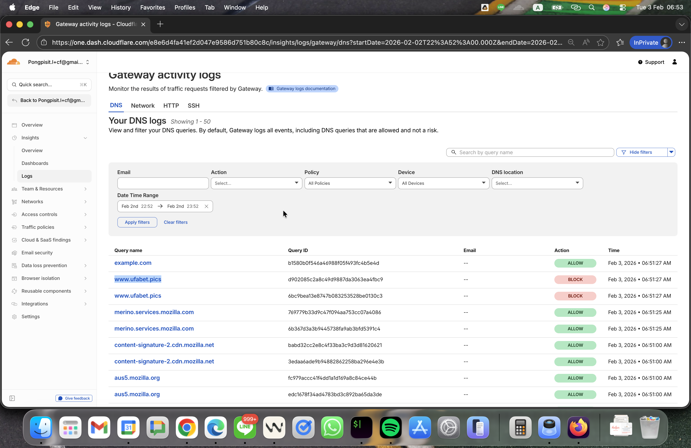

**Check the logs:**
- **Allowed queries** - Green checkmark (ALLOW)
- **Blocked queries** - Red badge (BLOCK)
- **Policy matched** - Shows which policy blocked it
- **Query details** - Domain, timestamp, action
- **Example:** You can see `www.ufabet.pics` blocked in the logs

---

## Step 12: Filter and Search Logs

1. Use the **Filter** options:
   - Filter by **Action** (Allowed/Blocked)
   - Filter by **Policy**
   - Filter by **Time range**

2. Click on any query to see details:
   - Source IP
   - Query type
   - Policy applied
   - Timestamp

---

## ✅ Checkpoint

You should now have:
- ✅ Checked domain categories on Cloudflare Radar
- ✅ Tested site access before configuration (baseline)
- ✅ Zero Trust account configured
- ✅ DNS security policy created
- ✅ Gambling content filtering enabled
- ✅ Malware, phishing, and C2 blocking enabled
- ✅ DoH configured in browser
- ✅ Verified gambling site is now blocked
- ✅ Tested malicious domain blocking
- ✅ Viewed DNS logs showing blocked queries

---

## What You've Accomplished

**DNS-Level Protection:**
- ✅ Gambling sites blocked by content category
- ✅ Malicious domains blocked at DNS resolution
- ✅ Phishing sites blocked before connection
- ✅ Command & Control servers blocked
- ✅ Spyware and cryptomining domains blocked
- ✅ Works on all devices using your DNS

**How DNS Security Works:**
1. User tries to visit a malicious domain
2. Device sends DNS query to Cloudflare Gateway
3. Gateway checks domain against threat intelligence database
4. If malicious, DNS query returns block page IP
5. User sees Cloudflare Gateway block page
6. No connection is made to the malicious site
7. Query is logged for review

**Key Benefits:**
- Blocks at DNS level (before connection)
- No software installation required
- Works transparently through DNS
- Protects all devices on the network
- Real-time threat intelligence updates
- Complete visibility in logs

**Important:** DNS security blocks access to malicious **domains/websites**, not individual file downloads. It operates at the network layer by preventing DNS resolution of known malicious domains.

---

## Workshop Complete!

You've successfully configured DNS security to block access to malicious domains and protect your network using Cloudflare Gateway.
